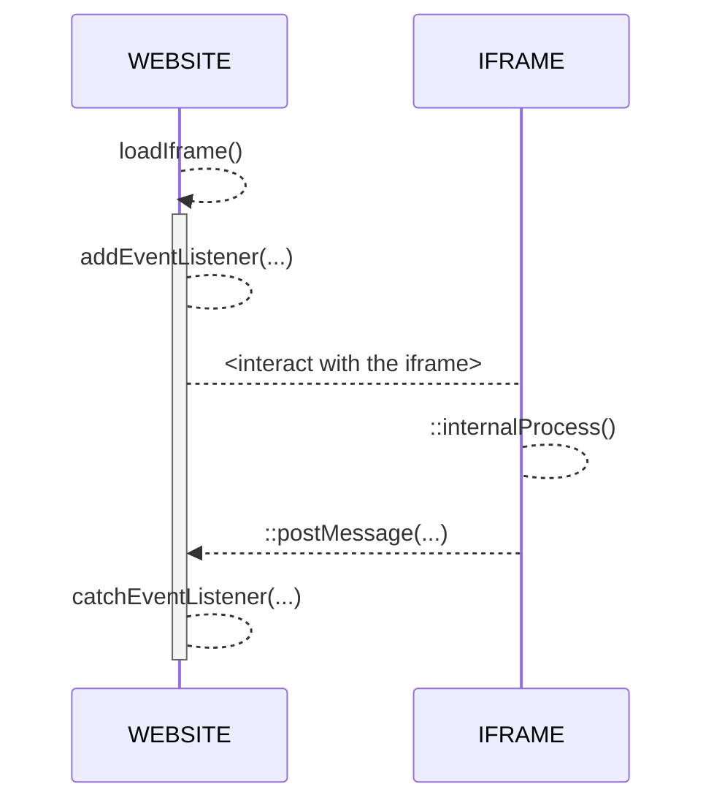

# Welcome to PWA Documentation !
Hi! The **Tchek PWA** is a web alternative to the native mobile application (iOS/Android).
There two way to access to the app :
- by `/auth/login` route
- by `/sso?token=<yourTokenId>` with you're unique temporary access token

### URLs
Direct Link : [here](https://devliveapi.tchek.fr/en/pwa/home)

### SSO
With the temporary access token, you will be automatically redirected to the first page you access with it.
Access to features are customizable per token :

|FEAT				|LOGIN							|SSO							|
|-------------------|-------------------------------|-------------------------------|
|Shoot-Inspect   	|Always							|only if enabled on token		|
|Fast-Track      	|Always							|only if enabled on token		|
|Report          	|Always							|only if enabled on token 		|

## IFRAME
At the end of any step, you'll receive an **event message** from the application.
In Vanilla Javascript, you can use an **event listener** for catch every events returned by the iframe :
> window.addEventListener("message", ...)

You can see DEMO juste here : [Parent](https://codesandbox.io/s/vanilla-iframe-parent-4pxknv) | [iFrame](https://codesandbox.io/s/vanilla-iframe-child-b0pdft?file=/index.html:841-881)
There's available on demo folder too.

### FLOW

