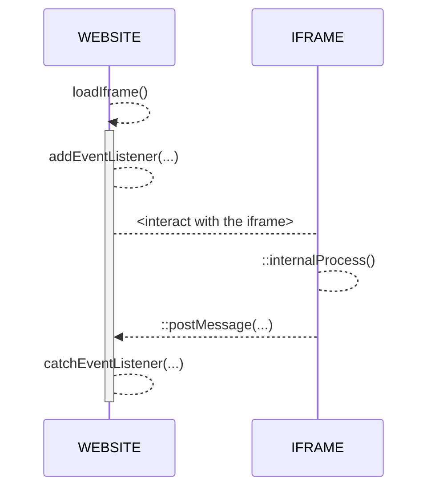

# Tchek PWA
Hi! Welcome to Tchek Documentation

The **Tchek PWA** is a web alternative to the native mobile application (iOS/Android).

## Generate SSO

Get your unique temporary token by using the following request
````
curl --location --request POST 'https://alto.tchek.fr/apiV1/tokenmanager/token' \
--header 'X-API-Key: <PERSONAL_API_TOKEN>' \
--header 'Content-Type: application/json' \
--data-raw '{
    "deviceId" : null,
    "validity" : 5,
    "tchekId" : "xXxXXxXXxx"
}'
````

## Usage

Install modules
````
npm install
````

Run demo after replaced `<TXXXXXX>` with your personal sso token in `/index.html`
````
npm run start
````

## How It's work ?
There two ways to access to the app :
- by `/auth/login` global route
- by `/sso?token=<TXXXXXX>` with your unique temporary access token

With the temporary access token, you will be automatically redirected to the first page you access with it.
Access to features are customizable per token :

|FEAT				|LOGIN							|SSO							|
|-------------------|-------------------------------|------------------------------|
|Shoot-Inspect   	|Always							|only if enabled on token		|
|Fast-Track      	|Always							|only if enabled on token		|
|Report          	|Always							|only if enabled on token 		|

### Events
At the end of any step, you'll receive an **event message** from the application.
In Vanilla Javascript, you can use an **event listener** for catch every events returned by the iframe :
````
document.addEventListener("DOMContentLoaded", function () {
     window.addEventListener("message", function (e) {
         const data = JSON.parse(e.data);
         console.log(data);
     });
 });
````
````
/* data */
{
    "status": 200,
    "message": "Tchek successfully created !",
    "date": 1652050366222,
    "tchek": {
        "tchek": {...},
        "damages": [...],
        "images": [...],
        "thirdPartyReport": {...}
    }
}
````

### Diagram



### Links
[PWA website](https://pwa.tchek.fr/en/pwa/home)

[API Documentation](https://alto.tchek.fr/api-docs)
