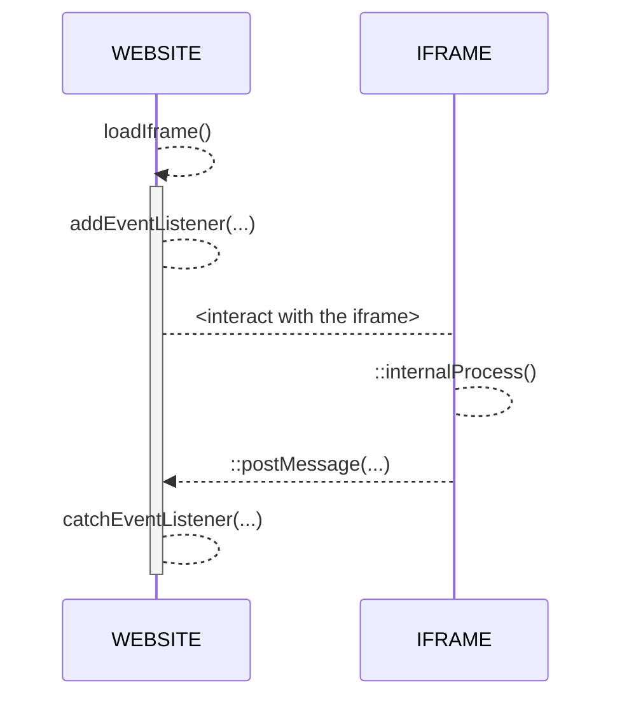

# Tchek SSO/PWA
Hi! Welcome to Tchek Documentation

The **Tchek PWA** is a web alternative to the native mobile application (iOS/Android).

*_Supported languages: `FR`|`EN`_

## How It's work ?
There two ways to access to the app :
- by `/auth/login` global route
- by `/sso?token=<TXXXXXX>` with your unique temporary access token

With the temporary access token, you will be automatically redirected to the first page you access with it.
Access to features are customizable per token :

|FEAT				|LOGIN							|SSO							|
|-------------------|-------------------------------|------------------------------|
|Shoot-Inspect   	|Always							|only if enabled on token		|
|Fast-Track      	|Always							|only if enabled on token		|
|Report          	|Always							|only if enabled on token 		|


## Generate SSO

Get your unique temporary token by using the following request
````
curl --location --request POST 'https://alto.tchek.fr/apiV1/tokenmanager/token' \
--header 'X-API-Key: <PERSONAL_API_TOKEN>' \
--header 'Content-Type: application/json' \
--data-raw '{
    "deviceId" : <uuid()>,
    "validity" : 5, // in days
    "tchekId" : "xXxXXxXXxx", // optional
    "shootInspect": true,
    "fastTrack": true,
    "report": true,
    "cost": false,
    "downloadRoi": false
}'
````
````
/* curl response */
{
  "uid": "T010203",
  "expired": false,
  "expiresIn": "12 May 2022 at 10:10:00 UTC",
  "options": "{"shootInspect": true, "fastTrack": true, "report": true, "cost": false, "downloadRoi": false}"
}
````

## Generate Report Url
For access to a specific web report, set the tchekId in request and use the `uid` object from response for build url
````
https://liveapi.tchek.ai/<lang>/report?token=T010203
````

## Usage PWA

Install modules
````
npm install
````

Run demo after replaced `<TXXXXXX>` with your personal sso token in `/index.html`
````
npm run start
````

### Events
At the end of any step, you'll receive an **event message** from the application.
In Vanilla Javascript, you can use the native **event listener** for catching every event returned by the iframe :
````
document.addEventListener("DOMContentLoaded", function () {
     window.addEventListener("message", function (e) {
         console.log(JSON.parse(e.data));
     });
 });
````
````
/* console.log(data) */
{
    "status": 200,
    "message": "Tchek successfully created !",
    "date": 1652050366222,
    "tchek": {
        "tchek": {...},
        "damages": [...],
        "images": [...],
        "thirdPartyReport": {...}
    }
}
````

### Diagram



### Links
[PWA website](https://pwa.tchek.fr/en/pwa/home)

[API Documentation](https://alto.tchek.fr/api-docs)
